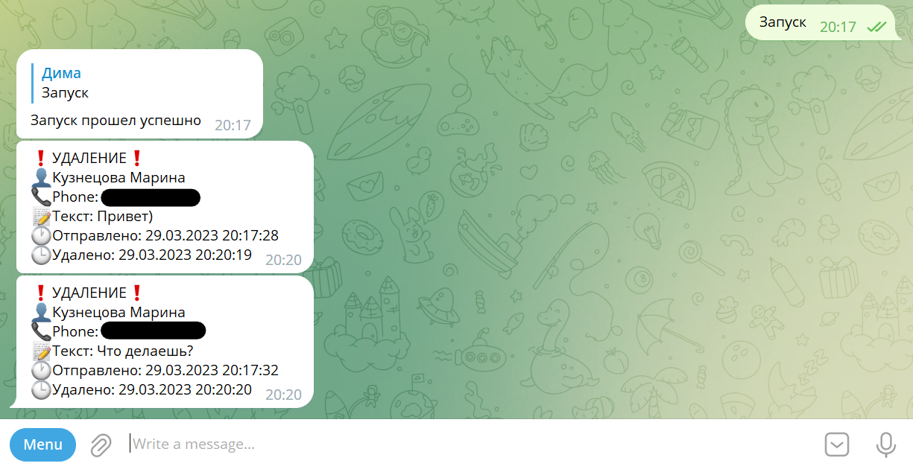

# tg_recovery
## Бот восстановления телеграм сообщений
Ваши сообщения теперь не пропадут, а отправятся Вам, если собеседник их удалит.

Подлежат восстановлению: текст, фото, видео, аудиосообщения и другие файлы.

Пример работы бота:

# Настройка

1. Клонируем репозиторий `git clone https://github.com/imf1ne/tg_recovery.git`

2. Устанавливаем зависимости: `pip install -r requirements.txt`

3. Меняем параметры в файле **recover/settings.yml**

    3.1. Создаем API приложение на сайте https://my.telegram.org/ и берем значения *api_id*, *api_hash*

    3.2. Вводим id чата телеграм, куда будут приходить восстановленные сообщения (желательно Избранные или такой чат, где никто не увидит сообщения. Сообщения бдут приходить в этот чат от вашего имени, так как бот работает от вашего аккаунта)

    3.3. Вводим свой часой пояс в формате для pytz (Пример: *"Europe/Moscow"*). Полный список тут: https://gist.github.com/heyalexej/8bf688fd67d7199be4a1682b3eec7568
    

# Запуск

python3 recover.py

После авторизации будет создан файл `Secret@Name$Session.session`, в нем хранится ключ сессии. В разделе устройства в телеграм появится новая сессия.

---

Также можно самостоятельно снять ограничения на размеры и типы файлов. Кроме того, у библиотеки telethon есть функционал, позволяющий обрабытвать изменение собеседником сообщений, позволяя нам узнать об этом. Это всё к планам на будущее)

---

Если воникнут предложения, пожелания или проблемы в настройке или запуске пишите на почту imfinev@yandex.ru или в телеграм `@imf1nev`
